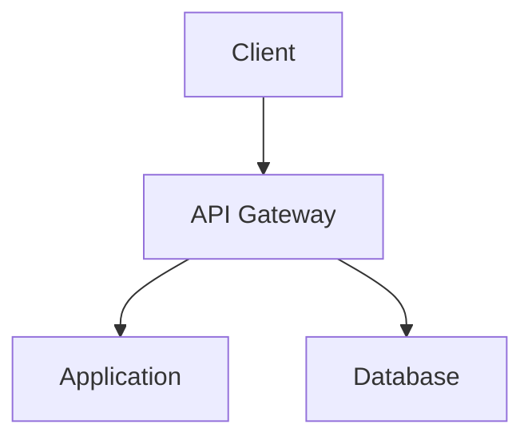
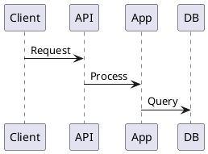

# Architecture Diagrams Guide

Guide for creating architecture diagrams with the Project Documentation Architect system.

## Overview

The system supports architecture diagrams through multiple document types and formats. This guide explains what's available and how to use it.

## Supported Document Types

### 1. SYSTEM_DIAGRAMS.md

**Purpose:** Dedicated document for all system diagrams

**What it includes:**
- High-Level Architecture Diagram
- Component Diagram
- Data Flow Diagram
- Sequence Diagrams (key flows)
- State Diagrams (if applicable)

**How to generate:**
```
"Create SYSTEM_DIAGRAMS.md for my project"
```

### 2. ARCHITECTURE_OVERVIEW.md

**Purpose:** Comprehensive architecture overview with diagrams

**What it includes:**
- System Overview
- Architecture Layers
- Pipeline Architecture
- Component Interactions
- Diagrams embedded in sections

**How to generate:**
```
"Create ARCHITECTURE_OVERVIEW.md with architecture diagrams"
```

### 3. TECH_SPEC_MVP.md

**Purpose:** Technical specification with architecture diagrams

**What it includes:**
- Architecture & Design section with diagrams
- Component Specifications
- Integration Points
- Deployment Architecture

**How to generate:**
```
"Create TECH_SPEC_MVP.md with architecture diagrams"
```

## Diagram Formats Supported

### Current Support

**1. Text Descriptions**
- Detailed text descriptions of architecture
- Component relationships explained in prose
- Data flow described step-by-step

**2. ASCII Art**
- Simple diagrams using ASCII characters
- Good for basic architecture visualization
- Works in any text editor

**Example ASCII Diagram:**
```
┌─────────────┐
│   Client    │
└──────┬──────┘
       │
       ▼
┌─────────────┐
│   API GW    │
└──────┬──────┘
       │
   ┌───┴───┐
   ▼       ▼
┌─────┐ ┌─────┐
│ App │ │ DB  │
└─────┘ └─────┘
```

**3. External Tool References**
- References to diagramming tools
- Links to Mermaid, PlantUML, Draw.io, etc.
- Instructions for creating diagrams externally

### Recommended External Tools

**Mermaid (Markdown-native):**
```markdown

```

**PlantUML:**
```markdown

```

**Draw.io / Diagrams.net:**
- Visual diagram editor
- Export to PNG/SVG
- Embed images in documents

## How to Request Diagrams

### Basic Request

**Simple:**
```
"Create SYSTEM_DIAGRAMS.md"
```

**With Details:**
```
"Create SYSTEM_DIAGRAMS.md for my microservices architecture:
- API Gateway
- User Service
- Product Service
- Database
- Message Queue"
```

### Specific Diagram Types

**High-Level Architecture:**
```
"Create ARCHITECTURE_OVERVIEW.md with high-level architecture diagram"
```

**Component Diagram:**
```
"Add component diagram to ARCHITECTURE_OVERVIEW.md showing:
- Frontend
- Backend Services
- Database
- Cache Layer"
```

**Data Flow:**
```
"Create SYSTEM_DIAGRAMS.md with data flow diagram for user registration process"
```

**Sequence Diagram:**
```
"Add sequence diagram to SYSTEM_DIAGRAMS.md for payment processing flow"
```

## Diagram Best Practices

### 1. Start with Text Description

**Why:**
- Ensures clarity before visualization
- Helps identify all components
- Documents relationships clearly

**Example:**
```
High-Level Architecture:

The system consists of three main layers:
1. Presentation Layer: React frontend, API Gateway
2. Application Layer: Node.js microservices
3. Data Layer: MongoDB, Redis cache

Data flows from Client → API Gateway → Services → Database
```

### 2. Use ASCII Art for Simple Diagrams

**When to use:**
- Simple architectures (3-5 components)
- Quick visualization needs
- Text-only environments

**Example:**
```
┌──────────┐
│  Client  │
└────┬─────┘
     │
     ▼
┌──────────┐
│ API GW   │
└────┬─────┘
     │
  ┌──┴──┐
  ▼     ▼
┌───┐ ┌───┐
│App│ │ DB│
└───┘ └───┘
```

### 3. Reference External Tools for Complex Diagrams

**When to use:**
- Complex architectures (10+ components)
- Need for visual diagrams
- Professional presentations

**Example:**
```
For detailed visual diagrams, use:
- Mermaid: https://mermaid.live/
- PlantUML: http://www.plantuml.com/
- Draw.io: https://app.diagrams.net/

See diagrams/architecture.mmd for Mermaid source
See diagrams/architecture.puml for PlantUML source
```

## Enhanced Diagram Support (Future)

### Potential Enhancements

**1. Mermaid Integration**
- Native Mermaid diagram generation
- Automatic diagram creation
- Embedded in Markdown documents

**2. PlantUML Integration**
- PlantUML diagram generation
- Sequence diagrams
- Component diagrams

**3. Diagram Templates**
- Pre-built diagram templates
- Common architecture patterns
- Quick diagram generation

**4. Visual Diagram Generation**
- AI-generated visual diagrams
- Export to PNG/SVG
- Interactive diagrams

## Current Limitations

### What's Not Supported Yet

1. **Visual Diagram Generation:**
   - No automatic visual diagram creation
   - No PNG/SVG export
   - No interactive diagrams

2. **Complex Diagram Types:**
   - Limited support for complex architectures
   - No automatic layout
   - No diagram validation

3. **Diagram Editing:**
   - No built-in diagram editor
   - Requires external tools
   - Manual updates needed

### Workarounds

**For Visual Diagrams:**
1. Generate text description
2. Use external tool (Mermaid/PlantUML)
3. Create diagram manually
4. Embed in document

**For Complex Diagrams:**
1. Break into multiple simple diagrams
2. Use hierarchical structure
3. Reference external detailed diagrams

## Examples

### Example 1: Simple Architecture

**Request:**
```
"Create SYSTEM_DIAGRAMS.md with high-level architecture for:
- React Frontend
- Node.js API
- MongoDB Database"
```

**Result:**
- Text description of architecture
- ASCII art diagram
- Component relationships
- Data flow description

### Example 2: Microservices Architecture

**Request:**
```
"Create ARCHITECTURE_OVERVIEW.md with microservices architecture:
- API Gateway
- User Service
- Product Service
- Order Service
- Database per service
- Message Queue"
```

**Result:**
- Detailed architecture description
- Component diagram (ASCII or text)
- Service interactions
- Data flow between services
- Reference to external diagram tool

### Example 3: Sequence Diagram

**Request:**
```
"Add sequence diagram to SYSTEM_DIAGRAMS.md for user registration flow:
1. User submits form
2. API validates
3. Create user in DB
4. Send welcome email
5. Return response"
```

**Result:**
- Sequence diagram description
- Step-by-step flow
- ASCII sequence diagram or
- PlantUML/Mermaid code reference

## Recommendations

### For Simple Projects

**Use:**
- Text descriptions
- ASCII art
- SYSTEM_DIAGRAMS.md document

### For Complex Projects

**Use:**
- Text descriptions in documents
- External tools (Mermaid/PlantUML) for visual diagrams
- Reference diagrams in documents
- Keep diagram sources in `diagrams/` directory

### For Professional Presentations

**Use:**
- Draw.io for visual diagrams
- Export to PNG/SVG
- Embed images in documents
- Maintain source files

## Summary

### What's Available Now

✅ **Text Descriptions** - Detailed architecture descriptions  
✅ **ASCII Art** - Simple visual diagrams  
✅ **External Tool References** - Links to Mermaid, PlantUML, etc.  
✅ **SYSTEM_DIAGRAMS.md** - Dedicated diagram document  
✅ **Architecture Sections** - Diagrams in architecture docs  

### What's Coming (Potential)

🔜 **Mermaid Integration** - Native Mermaid support  
🔜 **PlantUML Integration** - Native PlantUML support  
🔜 **Visual Diagram Generation** - AI-generated diagrams  
🔜 **Diagram Templates** - Pre-built templates  

---

**See Also:**
- `docs/SYSTEM_DIAGRAMS.md` - Example diagram document (when generated)
- `docs/ARCHITECTURE_OVERVIEW.md` - Architecture overview with diagrams
- `docs/knowledge-base/documentation_architect_reference.md` - Diagram templates

